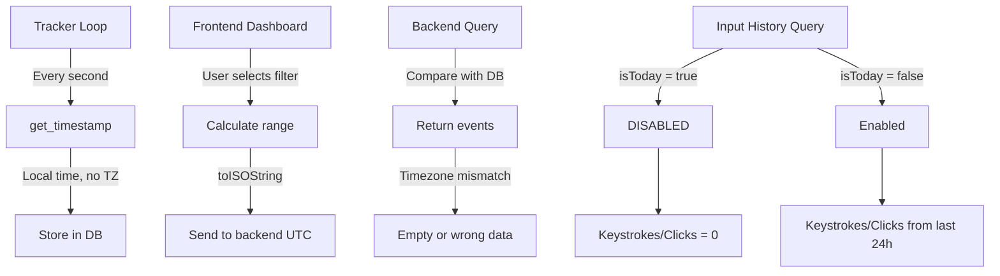
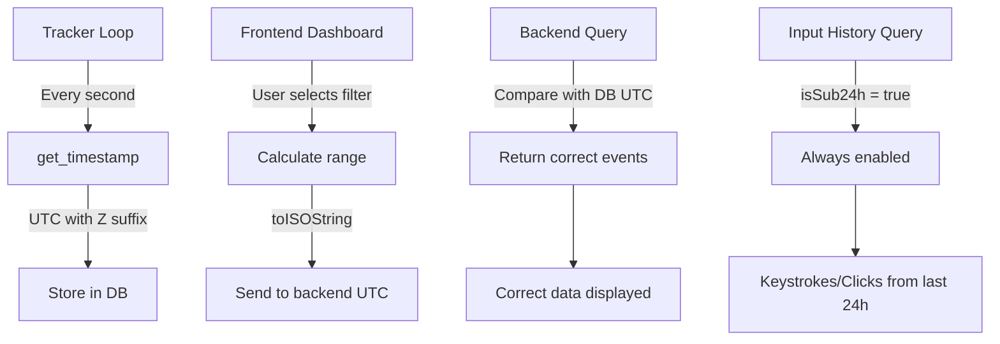

# Date Filter Issues Analysis & Fix Plan

## Executive Summary

This document analyzes the date filter issues in the Activity Tracker Tauri app, specifically:
1. Data not populating for "Past 1 Hour" filter
2. Keystroke and mouse click data unavailable for all date ranges except "Today"

## Root Cause Analysis

### Issue 1: Timezone Mismatch Between Frontend and Backend

**Problem Location:**
- Backend: [`src-tauri/src/windows_api.rs:141-142`](../src-tauri/src/windows_api.rs:141-142)
- Frontend: [`src/hooks/useDashboardData.ts:17-23`](../src/hooks/useDashboardData.ts:17-23)

**Current Behavior:**
```rust
// Backend uses LOCAL time (no timezone suffix)
pub fn get_timestamp() -> String {
    chrono::Local::now().format("%Y-%m-%dT%H:%M:%S%.3f").to_string()
}
```

```typescript
// Frontend treats timestamps as UTC by appending 'Z'
function parseValues(timestamp: string): number {
    if (!timestamp.endsWith('Z') && !timestamp.match(/[+-]\d{2}:\d{2}$/)) {
        return new Date(timestamp + 'Z').getTime(); // Forces UTC interpretation
    }
    return new Date(timestamp).getTime();
}
```

**Impact:**
- Backend stores timestamps in local time (e.g., "2026-01-25T12:00:00.000" for 12 PM local)
- Frontend interprets these as UTC (e.g., 12 PM UTC = 11 PM AEST, 10 PM AEDT)
- This causes incorrect time range filtering when calculating overlaps

### Issue 2: Input History Query Disabled for "Today"

**Problem Location:**
- [`src/hooks/useDashboardData.ts:139`](../src/hooks/useDashboardData.ts:139)

**Current Behavior:**
```typescript
const inputHistoryQuery = useInputHistory(1, isSub24h && !isToday);
```

**Impact:**
- For "today" range: `isSub24h = true`, `isToday = true` → Query **DISABLED**
- For "past_1h" range: `isSub24h = true`, `isToday = false` → Query enabled
- Result: Keystrokes and mouse clicks show 0 for "today" filter

### Issue 3: Timestamp Format Inconsistency

**Problem Location:**
- Storage: [`src-tauri/src/windows_api.rs:142`](../src-tauri/src/windows_api.rs:142) - `"%Y-%m-%dT%H:%M:%S%.3f"` (with milliseconds)
- Query: [`src-tauri/src/commands.rs:84`](../src-tauri/src/commands.rs:84) - `"%Y-%m-%dT%H:%M:%S"` (no milliseconds)

**Impact:**
- String comparison in SQL may not work correctly due to format mismatch
- Millisecond precision is lost during query

### Issue 4: Input History Limited to 24 Hours

**Problem Location:**
- [`src-tauri/src/commands.rs:79-86`](../src-tauri/src/commands.rs:79-86)

**Current Behavior:**
```rust
pub fn get_input_history(state: State<AppState>, interval_minutes: u32) -> Vec<InputHistoryBucket> {
    let now = Local::now();
    let start_time = now - Duration::hours(24); // Hardcoded 24 hours
    // ...
}
```

**Impact:**
- Input history (keystrokes/clicks) only available for last 24 hours
- Cannot retrieve historical input data for "yesterday", "week", "month" ranges

### Issue 5: Date Range Calculation Issues

**Problem Location:**
- [`src/hooks/useDashboardData.ts:73-78`](../src/hooks/useDashboardData.ts:73-78)

**Current Behavior:**
```typescript
case 'past_1h':
    start.setTime(now.getTime() - (60 * 60 * 1000));
    isSubDay = true;
    isSub24h = true;
    // ...
```

**Impact:**
- Frontend uses JavaScript Date (local time) for range calculation
- Backend uses chrono Local time
- Both should work, but the 'Z' suffix issue causes problems

## Detailed Flow Analysis

### For "Past 1 Hour" Filter:

1. Frontend calculates: `start = now - 1 hour`, `end = now` (local JS time)
2. Frontend calls `get_timeline_range(start.toISOString(), end.toISOString())`
   - `toISOString()` produces UTC timestamps
3. Backend queries `window_events` table using UTC timestamps
4. Backend stores timestamps in LOCAL time
5. **Result**: Mismatch causes no events to be returned

### For "Today" Filter - Input History:

1. `isToday = true`, `isSub24h = true`
2. Input history query: `isSub24h && !isToday = false`
3. Query is **disabled**
4. Keystrokes/clicks show 0 even though backend has the data

## Proposed Solutions

### Solution 1: Standardize on UTC Timezone (Recommended)

**Backend Changes:**

1. Update [`src-tauri/src/windows_api.rs`](../src-tauri/src/windows_api.rs):
```rust
pub fn get_timestamp() -> String {
    chrono::Utc::now().to_rfc3339_opts(chrono::SecondsFormat::Millis, true)
    // Produces: "2026-01-25T12:00:00.000Z"
}
```

2. Update [`src-tauri/src/commands.rs`](../src-tauri/src/commands.rs):
```rust
pub fn get_input_history(state: State<AppState>, interval_minutes: u32) -> Vec<InputHistoryBucket> {
    let now = chrono::Utc::now();
    let start_time = now - Duration::hours(24);
    let start_iso = start_time.to_rfc3339_opts(chrono::SecondsFormat::Secs, true);
    // ...
}
```

**Frontend Changes:**

1. Update [`src/hooks/useDashboardData.ts`](../src/hooks/useDashboardData.ts):
```typescript
function parseValues(timestamp: string): number {
    // Timestamps now have 'Z' suffix, parse directly
    return new Date(timestamp).getTime();
}
```

**Benefits:**
- Consistent timezone handling
- No more 'Z' suffix issues
- Standard ISO 8601 format

### Solution 2: Fix Input History Query for "Today"

**Frontend Changes:**

Update [`src/hooks/useDashboardData.ts:139`](../src/hooks/useDashboardData.ts:139):
```typescript
// Enable input history for all sub-24h ranges including "today"
const inputHistoryQuery = useInputHistory(1, isSub24h);
```

**Benefits:**
- Keystrokes/clicks will show for "today" filter
- Consistent behavior across sub-24h ranges

### Solution 3: Extend Input History Retention (Optional)

**Backend Changes:**

1. Update [`src-tauri/src/commands.rs`](../src-tauri/src/commands.rs) to accept date range:
```rust
#[tauri::command]
pub fn get_input_history_range(
    state: State<AppState>,
    start_iso: String,
    end_iso: String,
    interval_minutes: u32
) -> Vec<InputHistoryBucket> {
    // Query input_activity table with custom date range
    let raw_data = state.tracker.lock().unwrap()
        .get_input_history_range(&start_iso, &end_iso);
    // ... bucketing logic
}
```

2. Update [`src-tauri/src/database.rs`](../src-tauri/src/database.rs):
```rust
pub fn get_input_history_in_range(
    conn: &Connection,
    start_iso: &str,
    end_iso: &str
) -> Result<Vec<InputHistoryEntry>> {
    let mut stmt = conn.prepare(
        "SELECT timestamp, keystrokes, mouse_clicks
         FROM input_activity
         WHERE timestamp >= ?1 AND timestamp <= ?2
         ORDER BY timestamp ASC"
    )?;
    // ...
}
```

**Benefits:**
- Can retrieve historical input data
- Consistent API with other range queries

### Solution 4: Fix Timestamp Format Consistency

**Backend Changes:**

Ensure consistent timestamp format throughout:
- Use `chrono::SecondsFormat::Millis` for storage
- Use `chrono::SecondsFormat::Secs` for queries if needed
- Always include timezone suffix ('Z' for UTC)

## Implementation Priority

### High Priority (Fixes core issues):
1. **Solution 1**: Standardize on UTC timezone
2. **Solution 2**: Enable input history for "today"

### Medium Priority (Improves functionality):
3. **Solution 4**: Fix timestamp format consistency

### Low Priority (Nice to have):
4. **Solution 3**: Extend input history retention

## Testing Strategy

After implementing fixes:

1. Test "Past 1 Hour" filter:
   - Verify screen time data appears
   - Verify keystrokes/clicks appear

2. Test "Today" filter:
   - Verify screen time data appears
   - Verify keystrokes/clicks appear (was broken before)

3. Test "Yesterday" filter:
   - Verify screen time data appears
   - Note: keystrokes/clicks may be 0 (expected without Solution 3)

4. Test "Past 6h", "Past 12h" filters:
   - Verify all data appears correctly

5. Test timezone edge cases:
   - Test at midnight boundary
   - Test across daylight saving time changes

## Mermaid Diagram: Current Data Flow



## Mermaid Diagram: Proposed Data Flow


