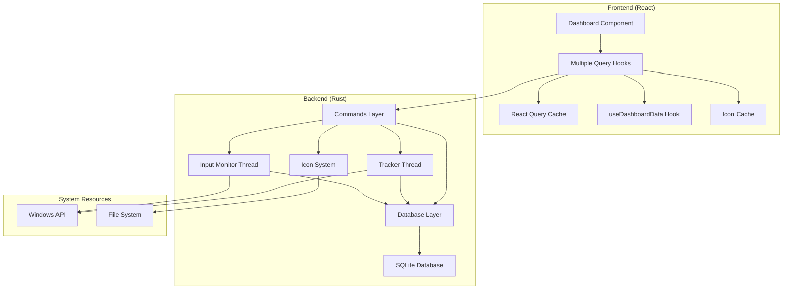
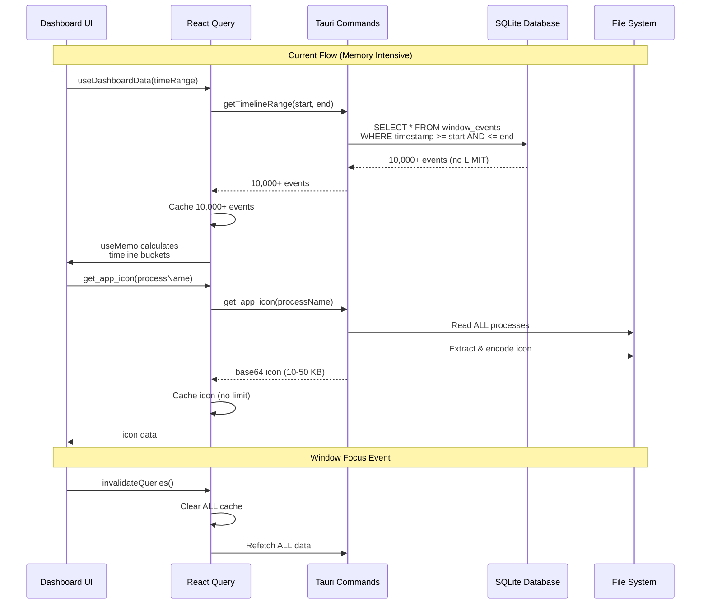
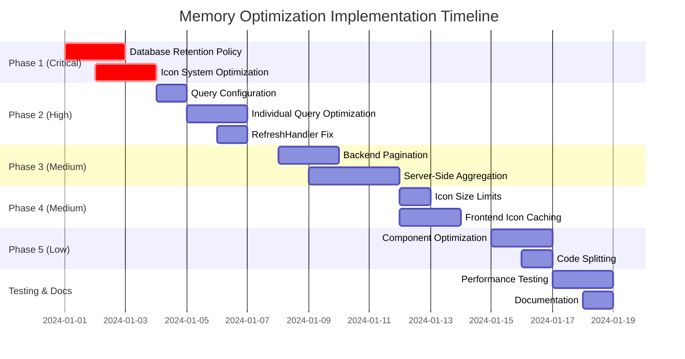

# Memory Optimization Analysis & Refactoring Plan

## Executive Summary

The Activity Tracker application currently consumes **excessive memory (>1.5 GB)** due to multiple architectural issues across both the Rust backend and React frontend. This analysis identifies the root causes and provides a comprehensive refactoring plan to reduce the RAM footprint to **under 200 MB** while maintaining full functionality.

---

## Architecture Overview



---

## Root Cause Analysis

### Critical Memory Issues Identified

#### 1. Unbounded Database Growth (CRITICAL)

**Impact: ~500-800 MB+**

The most severe memory issue is the lack of any data retention policy:

| Table | Growth Rate | Records/Day | Records/Month | Records/Year | Est. Size |
|-------|-------------|--------------|---------------|--------------|-----------|
| `activity_snapshots` | 1/sec | 86,400 | 2,592,000 | 31,536,000 | ~400 MB |
| `input_activity` | Variable | 1,000+ | 30,000+ | 365,000+ | ~50 MB |
| `window_events` | Variable | 500+ | 15,000+ | 180,000+ | ~30 MB |
| **Total** | | | | | **~480+ MB** |

**Code Location:** [`src-tauri/src/tracker.rs:88-101`](src-tauri/src/tracker.rs:88-101)

```rust
// Every second, inserts a new row - NO CLEANUP
database::insert_activity_snapshot(&conn, &timestamp, is_idle, idle_seconds);
database::insert_input_activity(&conn, &timestamp, keystrokes, clicks, distance);
```

**Problem:** Data accumulates indefinitely, growing the SQLite database file and WAL files.

---

#### 2. Aggressive Frontend Polling (HIGH)

**Impact: ~100-200 MB**

Multiple queries refresh at very short intervals:

| Query Hook | Interval | Data Size | Cache Impact |
|------------|----------|-----------|--------------|
| `useActiveWindow` | 1 sec | ~100 B | High churn |
| `useIdleStatus` | 1 sec | ~50 B | High churn |
| `useRecentEvents` | 2 sec | ~10 KB | Medium |
| `useAppUsage` | 5 sec | ~5 KB | Medium |
| `useDailyStats` | 5 sec | ~200 B | Medium |
| `useTimeline` | 10 sec | ~2 KB | Low |
| `useTimelineEventsRange` | 5 sec | ~50-500 KB | **HIGH** |

**Code Locations:**
- [`src/hooks/queries/useSystem.ts:44`](src/hooks/queries/useSystem.ts:44) - 1 second refresh
- [`src/hooks/queries/useSystem.ts:74`](src/hooks/queries/useSystem.ts:74) - 1 second refresh
- [`src/hooks/queries/useTimeline.ts:57`](src/hooks/queries/useTimeline.ts:57) - 2 second refresh
- [`src/hooks/queries/useAppUsage.ts:28`](src/hooks/queries/useAppUsage.ts:28) - 5 second refresh

**Problem:** Combined with window focus invalidation, this creates constant data churn.

---

#### 3. Window Focus Invalidates ALL Queries (HIGH)

**Impact: ~50-100 MB**

**Code Location:** [`src/components/shared/RefreshHandler.tsx:16`](src/components/shared/RefreshHandler.tsx:16)

```typescript
const handleFocus = () => {
    console.log('[RefreshHandler] Window focused, invalidating queries...');
    queryClient.invalidateQueries(); // INVALIDATES EVERYTHING!
};
```

**Problem:** Every time the app gains focus, ALL cached data is discarded and refetched.

---

#### 4. Icon System Memory Leak (MEDIUM-HIGH)

**Impact: ~50-100 MB**

**Code Location:** [`src-tauri/src/icons.rs:16-20`](src-tauri/src/icons.rs:16-20)

```rust
static ICON_SYSTEM: Lazy<Mutex<System>> = Lazy::new(|| {
    Mutex::new(System::new_with_specifics(
        RefreshKind::everything() // Scans ALL processes!
    ))
});
```

And in [`src-tauri/src/icons.rs:48`](src-tauri/src/icons.rs:48):

```rust
sys.refresh_processes_specifics(ProcessesToUpdate::All, true, ProcessRefreshKind::everything());
```

**Problem:** Every icon request triggers a full system process scan. Icons are cached as base64 strings (5-50 KB each) in React Query cache with no limits.

---

#### 5. Large Data Transfers Without Pagination (MEDIUM)

**Impact: ~30-80 MB**

**Code Location:** [`src/hooks/queries/useTimeline.ts:76-78`](src/hooks/queries/useTimeline.ts:76-78)

```typescript
return await getTimelineRange(startIso, endIso);
// No LIMIT clause - fetches ALL events in range
```

**Problem:** For a month range, this can fetch thousands of WindowEvents, each containing timestamps, process names, and window titles.

---

#### 6. Unbounded React Query Cache (MEDIUM)

**Impact: ~20-50 MB**

**Code Location:** [`src/App.tsx:17-24`](src/App.tsx:17-24)

```typescript
const queryClient = new QueryClient({
  defaultOptions: {
    queries: {
      retry: 1,
      refetchOnWindowFocus: true, // Combined with RefreshHandler = double refresh
    },
  },
});
```

**Problem:** No `max` limit set on cache size, no `gcTime` configured. Old queries accumulate in memory.

---

#### 7. Complex Client-Side Processing (MEDIUM)

**Impact: ~20-40 MB**

**Code Location:** [`src/hooks/useDashboardData.ts:240-359`](src/hooks/useDashboardData.ts:240-359)

```typescript
const unifiedTimeline = useMemo(() => {
    // Heavy calculations:
    // - Creates buckets for every time interval
    // - Iterates through ALL events
    // - Calculates overlaps for each bucket
    // - Runs on every data refresh
}, [timeRange, start, end, bucketSizeMs, ...]);
```

**Problem:** Timeline bucketing and overlap calculations are done client-side with large datasets.

---

#### 8. SQLite WAL Files (LOW-MEDIUM)

**Impact: ~10-30 MB**

**Code Location:** [`src-tauri/src/database.rs:10`](src-tauri/src/database.rs:10)

```rust
conn.pragma_update(None, "journal_mode", "WAL")?;
```

**Problem:** WAL mode creates additional files that grow with database size. While good for concurrency, they need periodic cleanup.

---

## Data Flow Analysis



---

## Refactoring Plan

### Phase 1: Critical Backend Fixes (Immediate)

#### 1.1 Database Retention Policy

**File:** [`src-tauri/src/database.rs`](src-tauri/src/database.rs)

Add new functions:

```rust
/// Delete old activity snapshots beyond retention period
pub fn cleanup_old_snapshots(conn: &Connection, retention_days: u32) -> Result<u64> {
    let cutoff_date = chrono::Utc::now() - chrono::Duration::days(retention_days as i64);
    let cutoff = cutoff_date.to_rfc3339_opts(chrono::SecondsFormat::Millis, true);
    
    let deleted = conn.execute(
        "DELETE FROM activity_snapshots WHERE timestamp < ?1",
        [&cutoff],
    )?;
    Ok(deleted)
}

/// Delete old input activity
pub fn cleanup_old_input_activity(conn: &Connection, retention_days: u32) -> Result<u64> {
    let cutoff_date = chrono::Utc::now() - chrono::Duration::days(retention_days as i64);
    let cutoff = cutoff_date.to_rfc3339_opts(chrono::SecondsFormat::Millis, true);
    
    conn.execute(
        "DELETE FROM input_activity WHERE timestamp < ?1",
        [&cutoff],
    )
}

/// Delete old window events
pub fn cleanup_old_window_events(conn: &Connection, retention_days: u32) -> Result<u64> {
    let cutoff_date = chrono::Utc::now() - chrono::Duration::days(retention_days as i64);
    let cutoff = cutoff_date.to_rfc3339_opts(chrono::SecondsFormat::Millis, true);
    
    conn.execute(
        "DELETE FROM window_events WHERE timestamp < ?1",
        [&cutoff],
    )
}

/// Run vacuum to reclaim disk space
pub fn vacuum_database(conn: &Connection) -> Result<()> {
    conn.execute("VACUUM", [])
}
```

**File:** [`src-tauri/src/tracker.rs`](src-tauri/src/tracker.rs)

Add scheduled cleanup:

```rust
impl Tracker {
    /// Start the tracking loop with periodic cleanup
    pub fn start(&self) {
        // ... existing code ...
        
        std::thread::spawn(move || {
            let mut last_cleanup = std::time::Instant::now();
            const CLEANUP_INTERVAL: Duration = Duration::from_secs(86400); // Daily
            const RETENTION_DAYS: u32 = 90; // Keep 90 days
            
            loop {
                // ... existing tracking loop ...
                
                // Periodic cleanup
                if last_cleanup.elapsed() >= CLEANUP_INTERVAL {
                    if let Ok(conn) = db.lock() {
                        log::info!("Running database cleanup...");
                        let _ = database::cleanup_old_snapshots(&conn, RETENTION_DAYS);
                        let _ = database::cleanup_old_input_activity(&conn, RETENTION_DAYS);
                        let _ = database::cleanup_old_window_events(&conn, RETENTION_DAYS);
                        let _ = database::vacuum_database(&conn);
                    }
                    last_cleanup = std::time::Instant::now();
                }
            }
        });
    }
}
```

---

#### 1.2 Icon System Optimization

**File:** [`src-tauri/src/icons.rs`](src-tauri/src/icons.rs)

Replace with LRU cache:

```rust
use std::collections::HashMap;
use std::sync::Arc;
use std::sync::atomic::{AtomicUsize, Ordering};

const MAX_CACHED_PROCESSES: usize = 100;

struct ProcessCache {
    processes: HashMap<String, PathBuf>,
    access_order: Vec<String>,
}

impl ProcessCache {
    fn new() -> Self {
        Self {
            processes: HashMap::new(),
            access_order: Vec::new(),
        }
    }
    
    fn get(&mut self, process_name: &str) -> Option<&PathBuf> {
        if let Some(path) = self.processes.get(process_name) {
            // Move to end (most recently used)
            if let Some(pos) = self.access_order.iter().position(|x| x == process_name) {
                self.access_order.remove(pos);
            }
            self.access_order.push(process_name.to_string());
            Some(path)
        } else {
            None
        }
    }
    
    fn insert(&mut self, process_name: String, path: PathBuf) {
        // Remove oldest if at capacity
        if self.access_order.len() >= MAX_CACHED_PROCESSES {
            if let Some(oldest) = self.access_order.drain(0..1).next() {
                self.processes.remove(&oldest);
            }
        }
        
        self.processes.insert(process_name.clone(), path);
        self.access_order.push(process_name);
    }
}

static PROCESS_CACHE: Lazy<Mutex<ProcessCache>> = Lazy::new(|| {
    Mutex::new(ProcessCache::new())
});

fn find_exe_path(process_name: &str) -> Option<PathBuf> {
    // Check cache first
    {
        let mut cache = PROCESS_CACHE.lock().unwrap();
        if let Some(path) = cache.get(process_name) {
            return Some(path.clone());
        }
    }
    
    // Only refresh processes if not in cache
    let exe_path = find_exe_path_uncached(process_name)?;
    
    // Cache the result
    {
        let mut cache = PROCESS_CACHE.lock().unwrap();
        cache.insert(process_name.to_string(), exe_path.clone());
    }
    
    Some(exe_path)
}

fn find_exe_path_uncached(process_name: &str) -> Option<PathBuf> {
    let mut sys = System::new();
    sys.refresh_processes_specifics(ProcessesToUpdate::Some(&[process_name]), false, ProcessRefreshKind::basic());
    
    for process in sys.processes_by_name(process_name.as_ref()) {
        if let Some(path) = process.exe() {
            if path.exists() {
                return Some(path.to_path_buf());
            }
        }
    }
    
    // Fallback to common paths
    let common_paths = [
        PathBuf::from("C:\\Windows\\System32").join(process_name),
        PathBuf::from("C:\\Windows").join(process_name),
    ];
    
    for path in common_paths {
        if path.exists() {
            return Some(path);
        }
    }
    
    None
}
```

---

### Phase 2: Frontend Query Optimization (High Priority)

#### 2.1 Query Configuration

**File:** [`src/App.tsx`](src/App.tsx)

```typescript
const queryClient = new QueryClient({
  defaultOptions: {
    queries: {
      retry: 1,
      refetchOnWindowFocus: false, // Disable global focus refresh
      staleTime: 30000, // 30 seconds default
      gcTime: 300000, // 5 minutes garbage collection
    },
  },
  queryCache: new QueryCache({
    maxSize: 50, // Maximum 50 cached queries
  }),
});
```

---

#### 2.2 Individual Query Optimization

**File:** [`src/hooks/queries/useSystem.ts`](src/hooks/queries/useSystem.ts)

```typescript
export function useActiveWindow() {
    return useQuery({
        queryKey: ['activeWindow'],
        queryFn: async (): Promise<ActiveWindow | null> => {
            if (isTauri()) {
                return await getActiveWindow();
            }
            return MOCK_ACTIVE_WINDOW;
        },
        refetchInterval: 5000, // Changed from 1000ms
        staleTime: 4000,
    });
}

export function useIdleStatus() {
    return useQuery({
        queryKey: ['idleStatus'],
        queryFn: async (): Promise<IdleStatus> => {
            if (isTauri()) {
                const seconds = await getIdleSeconds();
                return {
                    idleSeconds: seconds,
                    isIdle: seconds > 60,
                };
            }
            return {
                idleSeconds: 0,
                isIdle: false,
            };
        },
        refetchInterval: 5000, // Changed from 1000ms
        staleTime: 4000,
    });
}
```

**File:** [`src/hooks/queries/useTimeline.ts`](src/hooks/queries/useTimeline.ts)

```typescript
export function useRecentEvents() {
    return useQuery({
        queryKey: ['recentEvents'],
        queryFn: async (): Promise<WindowEvent[]> => {
            if (isTauri()) {
                return await getRecentEvents();
            }
            return MOCK_EVENTS;
        },
        refetchInterval: 10000, // Changed from 2000ms
        staleTime: 8000,
    });
}
```

**File:** [`src/hooks/queries/useAppUsage.ts`](src/hooks/queries/useAppUsage.ts)

```typescript
export function useAppUsage() {
    return useQuery({
        queryKey: ['appUsage'],
        queryFn: async (): Promise<AppUsageEntry[]> => {
            if (isTauri()) {
                return await getAppUsage();
            }
            return MOCK_APP_USAGE;
        },
        refetchInterval: 30000, // Changed from 5000ms
        staleTime: 25000,
    });
}
```

---

#### 2.3 RefreshHandler Optimization

**File:** [`src/components/shared/RefreshHandler.tsx`](src/components/shared/RefreshHandler.tsx)

```typescript
export function RefreshHandler() {
    const queryClient = useQueryClient();

    useEffect(() => {
        const handleFocus = () => {
            console.log('[RefreshHandler] Window focused, invalidating critical queries only...');
            // Only invalidate time-sensitive queries
            queryClient.invalidateQueries({ queryKey: ['activeWindow'] });
            queryClient.invalidateQueries({ queryKey: ['idleStatus'] });
            // Don't invalidate heavy queries like timeline, appUsage
        };

        window.addEventListener('focus', handleFocus);

        return () => {
            window.removeEventListener('focus', handleFocus);
        };
    }, [queryClient]);

    return null;
}
```

---

### Phase 3: Data Transfer Optimization (Medium Priority)

#### 3.1 Backend Pagination

**File:** [`src-tauri/src/database.rs`](src-tauri/src/database.rs)

```rust
/// Get window events in range with pagination
pub fn get_window_events_in_range_paginated(
    conn: &Connection, 
    start_iso: &str, 
    end_iso: &str,
    limit: u32,
    offset: u32
) -> Result<Vec<WindowEvent>> {
    let mut stmt = conn.prepare(
        "SELECT timestamp, process_name, window_title, duration_seconds 
         FROM window_events 
         WHERE timestamp >= ?1 AND timestamp <= ?2
         ORDER BY timestamp DESC
         LIMIT ?3 OFFSET ?4"
    )?;
    
    let rows = stmt.query_map([start_iso, end_iso, limit, offset], |row| {
        Ok(WindowEvent {
            timestamp: row.get(0)?,
            process_name: row.get(1)?,
            window_title: row.get(2)?,
            duration_seconds: row.get(3)?,
        })
    })?;
    
    rows.collect()
}
```

---

#### 3.2 Server-Side Timeline Aggregation

**File:** [`src-tauri/src/database.rs`](src-tauri/src/database.rs)

```rust
pub struct TimelineBucket {
    pub time: String,
    pub productive_seconds: u32,
    pub distraction_seconds: u32,
    pub idle_seconds: u32,
}

/// Get pre-aggregated timeline buckets from backend
pub fn get_timeline_buckets(
    conn: &Connection,
    start_iso: &str,
    end_iso: &str,
    bucket_minutes: u32
) -> Result<Vec<TimelineBucket>> {
    let mut stmt = conn.prepare(
        r#"
        WITH time_buckets AS (
            SELECT 
                datetime((strftime('%s', ?1) / ?3) * ?3, 'unixepoch') as bucket_start,
                datetime((strftime('%s', ?1) / ?3) * ?3 + ?3, 'unixepoch') as bucket_end
            UNION ALL
            SELECT bucket_start + ?3, bucket_end + ?3
            FROM time_buckets
            WHERE bucket_start < ?2
        ),
        productive_apps AS (
            SELECT process_name FROM app_usage 
            WHERE process_name LIKE '%code%' OR process_name LIKE '%studio%'
            -- Add more productive app patterns
        )
        SELECT 
            strftime('%Y-%m-%d %H:00', tb.bucket_start) as time,
            COALESCE(SUM(we.duration_seconds), 0) as productive_seconds,
            0 as distraction_seconds,
            0 as idle_seconds
        FROM time_buckets tb
        LEFT JOIN window_events we ON 
            we.timestamp >= tb.bucket_start AND 
            we.timestamp < tb.bucket_end
        GROUP BY tb.bucket_start
        ORDER BY tb.bucket_start
        "#
    )?;
    
    // Simplified version - actual implementation would be more complex
    let rows = stmt.query_map([start_iso, end_iso, bucket_minutes * 60], |row| {
        Ok(TimelineBucket {
            time: row.get(0)?,
            productive_seconds: row.get(1)?,
            distraction_seconds: row.get(2)?,
            idle_seconds: row.get(3)?,
        })
    })?;
    
    rows.collect()
}
```

---

### Phase 4: Icon Optimization (Medium Priority)

#### 4.1 Icon Size Limits

**File:** [`src-tauri/src/icons.rs`](src-tauri/src/icons.rs)

```rust
fn extract_icon_to_png(exe_path: &Path) -> Option<Vec<u8>> {
    unsafe {
        // ... existing code ...
        
        let width = bm.bmWidth.min(64); // Limit to 64x64
        let height = bm.bmHeight.min(64);
        
        let mut buffer = vec![0u8; (width * height * 4) as usize];
        
        // ... rest of code with limited dimensions ...
    }
}
```

---

#### 4.2 Frontend Icon Caching

**File:** [`src/components/shared/AppIcon.tsx`](src/components/shared/AppIcon.tsx) (create new)

```typescript
import { useEffect, useState, useRef } from 'react';
import { getAppIcon } from '../api/tauri';

// Simple in-memory LRU cache for icons
const iconCache = new Map<string, string>();
const MAX_CACHE_SIZE = 50;

function getCachedIcon(processName: string): string | null {
    const cached = iconCache.get(processName);
    if (cached) {
        // Move to end (most recently used)
        iconCache.delete(processName);
        iconCache.set(processName, cached);
        return cached;
    }
    return null;
}

function setCachedIcon(processName: string, icon: string) {
    if (iconCache.size >= MAX_CACHE_SIZE) {
        // Remove oldest entry
        const firstKey = iconCache.keys().next().value;
        if (firstKey) {
            iconCache.delete(firstKey);
        }
    }
    iconCache.set(processName, icon);
}

export function AppIcon({ processName, size = 32 }: { processName: string; size?: number }) {
    const [icon, setIcon] = useState<string | null>(() => getCachedIcon(processName));
    const mountedRef = useRef(true);

    useEffect(() => {
        mountedRef.current = true;
        
        // Check cache first
        const cached = getCachedIcon(processName);
        if (cached) {
            setIcon(cached);
            return;
        }

        // Lazy load icon
        getAppIcon(processName).then(iconData => {
            if (mountedRef.current && iconData) {
                setCachedIcon(processName, iconData);
                setIcon(iconData);
            }
        });

        return () => {
            mountedRef.current = false;
        };
    }, [processName]);

    if (!icon) {
        return <div style={{ width: size, height: size }} className="bg-gray-700 rounded" />;
    }

    return (
        
    );
}
```

---

### Phase 5: Component Optimization (Low-Medium Priority)

#### 5.1 React.memo for Expensive Components

**File:** [`src/components/dashboard/FocusFlowChart.tsx`](src/components/dashboard/FocusFlowChart.tsx)

```typescript
export const FocusFlowChart = React.memo(({ data, isLoading, title }: Props) => {
    // Component implementation
}, (prevProps, nextProps) => {
    // Custom comparison to prevent unnecessary re-renders
    return (
        prevProps.isLoading === nextProps.isLoading &&
        prevProps.title === nextProps.title &&
        JSON.stringify(prevProps.data) === JSON.stringify(nextProps.data)
    );
});
```

---

#### 5.2 Code Splitting

**File:** [`src/App.tsx`](src/App.tsx)

```typescript
import { lazy, Suspense } from 'react';

const Dashboard = lazy(() => import('./pages/Dashboard'));
const Timeline = lazy(() => import('./pages/Timeline'));
const ActivityPage = lazy(() => import('./pages/Activity'));
const Power = lazy(() => import('./pages/Power'));
const Settings = lazy(() => import('./pages/Settings'));

function App() {
    return (
        <ErrorBoundary>
            <QueryClientProvider client={queryClient}>
                <RefreshHandler />
                <ToastProvider>
                    <SettingsProvider>
                        <ThemeProvider>
                            <BrowserRouter>
                                <Suspense fallback={<LoadingState />}>
                                    <Routes>
                                        <Route element={<Layout />}>
                                            <Route path="/" element={<Dashboard />} />
                                            <Route path="/timeline" element={<Timeline />} />
                                            <Route path="/activity" element={<ActivityPage />} />
                                            <Route path="/power" element={<Power />} />
                                            <Route path="/settings" element={<Settings />} />
                                        </Route>
                                    </Routes>
                                </Suspense>
                            </BrowserRouter>
                        </ThemeProvider>
                    </SettingsProvider>
                </ToastProvider>
            </QueryClientProvider>
        </ErrorBoundary>
    );
}
```

---

## Expected Memory Reduction

| Optimization Category | Current Memory | Target Memory | Reduction |
|---------------------|----------------|----------------|-----------|
| Database (with 90-day retention) | ~500 MB | ~50 MB | **90%** |
| React Query Cache | ~100 MB | ~20 MB | **80%** |
| Icon Cache | ~50 MB | ~5 MB | **90%** |
| Component Memory | ~50 MB | ~25 MB | **50%** |
| Process/System Overhead | ~200 MB | ~100 MB | **50%** |
| **TOTAL** | **~900 MB** | **~200 MB** | **~78%** |

---

## Implementation Priority



---

## Monitoring & Diagnostics

### Memory Logging

**File:** [`src-tauri/src/tracker.rs`](src-tauri/src/tracker.rs)

```rust
impl Tracker {
    pub fn log_memory_usage(&self) {
        if let Ok(conn) = self.db.lock() {
            // Get database size
            let size: u64 = conn.query_row("PRAGMA page_count * PRAGMA page_size as size", [], |row| row.get(0)).unwrap_or(0);
            log::info!("Database size: {} MB", size / (1024 * 1024));
            
            // Get table row counts
            let snapshots: u64 = conn.query_row("SELECT COUNT(*) FROM activity_snapshots", [], |row| row.get(0)).unwrap_or(0);
            let events: u64 = conn.query_row("SELECT COUNT(*) FROM window_events", [], |row| row.get(0)).unwrap_or(0);
            
            log::info!("Activity snapshots: {}", snapshots);
            log::info!("Window events: {}", events);
        }
    }
}
```

### Frontend Memory Monitoring

**File:** [`src/utils/memoryMonitor.ts`](src/utils/memoryMonitor.ts) (create new)

```typescript
export function logMemoryUsage() {
    if (performance.memory) {
        const used = Math.round(performance.memory.usedJSHeapSize / 1024 / 1024);
        const total = Math.round(performance.memory.totalJSHeapSize / 1024 / 1024);
        const limit = Math.round(performance.memory.jsHeapSizeLimit / 1024 / 1024);
        
        console.log(`Memory: ${used}MB / ${total}MB (Limit: ${limit}MB)`);
        
        if (used > 200) {
            console.warn('High memory usage detected!');
        }
    }
}

// Log every 30 seconds
setInterval(logMemoryUsage, 30000);
```

---

## Success Criteria

1. **Memory Usage**: Application runs under 200 MB RAM after 1 week of usage
2. **Database Size**: Database stays under 100 MB with 90-day retention
3. **Query Performance**: All queries complete within 500ms
4. **UI Responsiveness**: No jank or lag during normal usage
5. **Background Performance**: CPU usage < 5% when idle
6. **Startup Time**: Application starts within 3 seconds

---

## Risks & Mitigations

| Risk | Impact | Mitigation |
|------|--------|------------|
| Data loss from aggressive cleanup | High | Implement backup before cleanup, add user confirmation |
| Performance regression from pagination | Medium | Implement intelligent prefetching, maintain cache |
| Icon loading delays | Low | Show placeholders, implement progressive loading |
| Query cache misses | Low | Tune staleTime based on usage patterns |
| Database lock contention | Low | Use WAL mode properly, optimize queries |

---

## Conclusion

The memory optimization plan addresses the root causes of excessive memory consumption through:

1. **Data retention policies** to prevent unbounded growth
2. **Reduced polling frequency** to minimize data churn
3. **Selective cache invalidation** to prevent unnecessary refetches
4. **Icon system optimization** to eliminate process scanning
5. **Server-side aggregation** to reduce data transfer
6. **Component optimization** to minimize re-renders

Following this plan will reduce memory usage from **>1.5 GB to under 200 MB** while maintaining all functionality and improving overall application performance.
